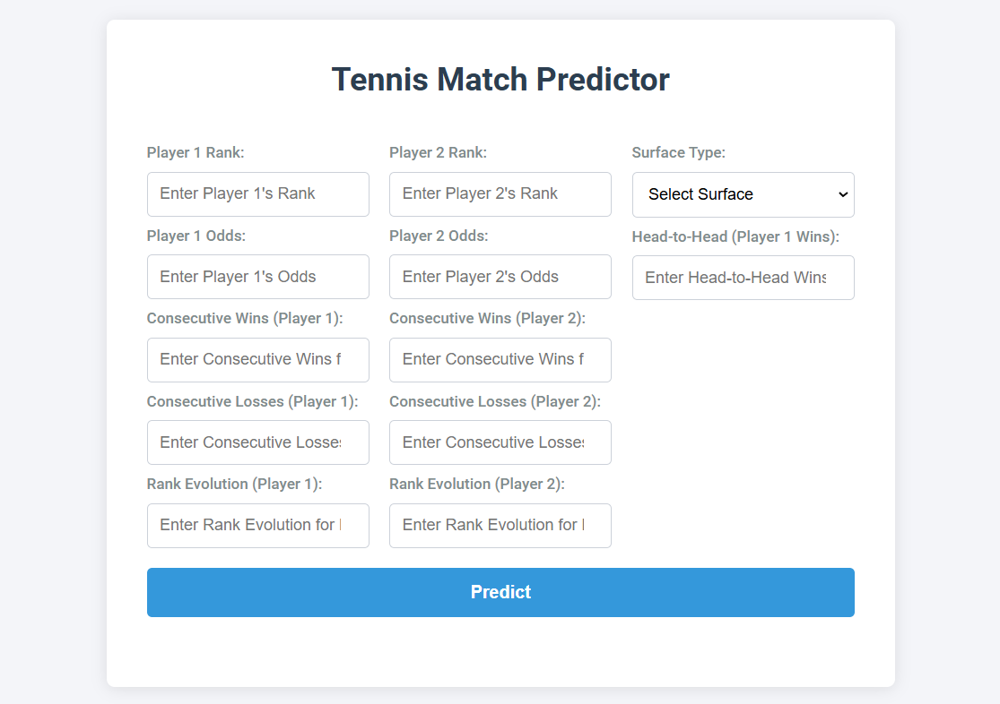

# Tennis Predictor

## Project Overview

This project aims to provide betting recommendations for tennis matches based on historical match data. By analyzing various features such as player rankings, head-to-head records, surface type, and recent performance, the recommendation system returns the predicted outcome of a tennis match, the level of confidence of the prediction and a suggestion based on the odds.

The proposed solution addresses a regression problem aimed at determining whether the player with the lowest odd is the winner in a tennis match. It involves building and transforming features from the dataset, selecting the most important features, applying a logistic regression model, optimizing hyperparameters through cross-validation by maximizing the betting profit.

## Table of Contents
- [Project Overview](#project-overview)
- [Data Collection](#data-collection)
- [Project Structure](#project-structure)
- [Installation](#installation)
- [Usage](#usage)
- [API Endpoints](#api-endpoints)
- [Contributing](#contributing)

## Data Collection

The data for this project is sourced from the following locations:
- [ATP Match Data](https://data.world/tylerudite/atp-match-data)
- [WTA Match Data](https://data.world/tylerudite/wta-match-data)

### Dataset Description
The dataset used in this project contains the following structure:

```python
date: The date of the match (type: datetime64)
winner: The name of the winning player (type: string)
loser: The name of the losing player (type: string)
wrank: The rank of the winning player (type: int64)
lrank: The rank of the losing player (type: int64)
b365w: The Bet365 odds for the winning player (type: float64)
b365l: The Bet365 odds for the losing player (type: float64)
surface: The surface on which the match was played (type: string)
```

## Project Structure

The project directory structure is organized as follows:


```python
└── 📁tennis-predictor
    └── 📁data
        └── 📁interim
            └── cleaned_data.csv
            └── features.csv
        └── 📁processed
            └── features.csv
            └── X_test.csv
            └── X_train.csv
            └── X_val.csv
            └── y_test.csv
            └── y_train.csv
            └── y_val.csv
        └── 📁raw
            └── 📁atp
                └── 2002.csv
                └── 2003.csv
                └── 2004.csv
                └── 2005.csv
                └── 2006.csv
                └── 2007.csv
                └── 2009.csv
                └── 2010.csv
                └── 2012.csv
                └── 2013.csv
                └── 2015.csv
                └── 2016.csv
                └── 2017.csv
                └── 2018.csv
            └── 📁wta
                └── 2007_2.csv
                └── 2008_2.csv
                └── 2009.csv
    └── 📁libs
        └── __init__.py
        └── data_utils.py
        └── eda_tools.py
    └── 📁logs
        └── dev.log
        └── prd.log
    └── 📁models
        └── logistic_model.joblib
    └── 📁notebooks
        └── 1.0-data-exploration.ipynb
        └── 2.0-feature-engineering.ipynb
        └── 3.0-model-selection.ipynb
    └── 📁pipeline
        └── 📁features
            └── __init__.py
            └── build_features.py
            └── h2h_features.py
            └── odds_features.py
            └── rank_features.py
            └── results_features.py
            └── surface_features.py
            └── transformations.py
        └── 📁models
            └── logistic_regression.py
        └── __init__.py
        └── clean_data.py
        └── predict.py
    └── 📁templates
        └── index.html
    └── .gitignore
    └── app.py
    └── main.py
    └── params.yaml
    └── README.md
    └── requirements.txt
```

## Installation

To set up the project, follow these steps:

1. Clone the repository:
    ```sh
    git clone https://github.com/inesmteixeira/tennis-predictor.git
    ```

2. Create and activate a virtual environment:
    ```sh
    python3 -m venv venv
    ```
    On Linux, use `source venv/bin/activate`  
    
    On Windows, use `venv\Scripts\activate`
    

3. Install the required packages:
    ```sh
    pip install -r requirements.txt
    ```

## Features
### Data Transformation
The transform_data.py script includes the following functions to preprocess and transform the data:

- **transform_data**: Reads raw ATP and WTA data, cleans and formats it, and combines the datasets.
- **add_ranks**: Adds player rankings to the dataset.
- **add_rank_dif**: Adds the difference in rankings between players.
- **add_odd_dif**: Adds the difference in betting odds between players.
- **add_rank_ratio**: Adds the ratio of rankings between players.
- **add_odd_ratio**: Adds the ratio of betting odds between players.
- **OHE_surface**: One-hot encodes the surface type.
- **add_consecutive_wins_and_losses**: Calculates consecutive wins and losses for each player.


## App Interface Visualization

Below is a mock visualization of the application interface for entering player statistics and visualizing match predictions.  




## Contributing

Contributions are welcome! Please follow these steps to contribute:

1. Fork the repository.
2. Create a new branch for your feature or bugfix.
3. Make your changes.
4. Submit a pull request with a description of your changes.
